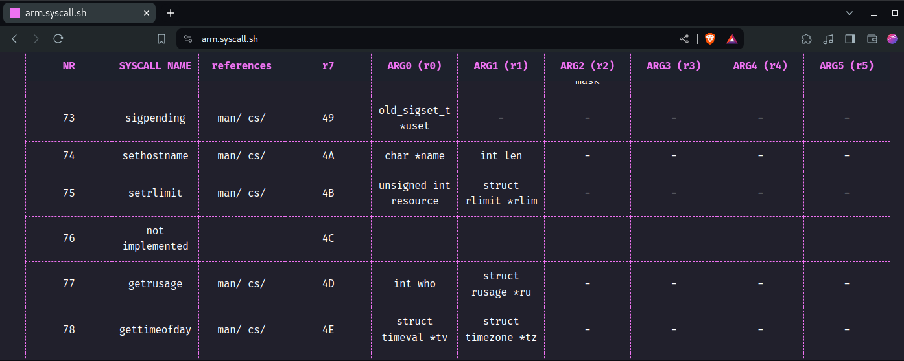

# what's this

makes the top bar at [syscall.sh](https://syscall.sh/) sticky. usefull when you do not have the calling convention memorized.

# how to use

 - method 1: add user script in `./tampermonkey/stickysyscall.user.js` to tampermonkey
 - method 2: enable developer mode in chromium-based browser extensions and add the `./extension` folder

# screenshot

